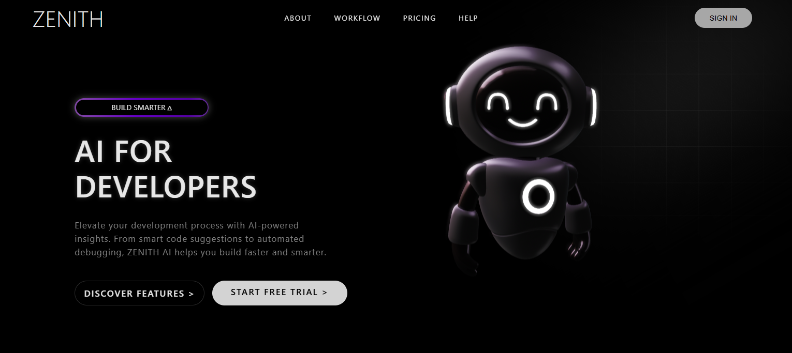
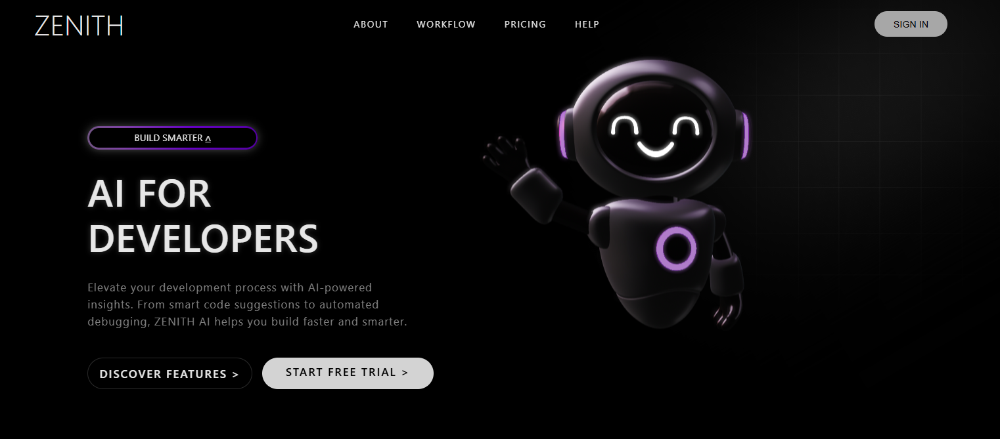

# 🌌 Zenith

**Zenith** is a modern, AI-themed landing page designed to showcase cutting-edge developer tools with a sleek 3D visual and smooth animated interface. Built with **HTML5**, **CSS3**, and **AOS (Animate On Scroll)**, it delivers a futuristic user experience enhanced by a reactive 3D robot that follows the cursor’s movement.

---

## 🚀 Features

- ✨ Smooth scroll animations powered by **AOS**
- 🤖 Interactive **3D robot model** that follows the cursor
- 🧠 Integrated **Spline 3D Viewer**
- 🎨 Dynamic gradient and soft light-blur background effects
- ⚡ Fast, minimal, and modern landing page layout

---

## 🛠️ Technologies Used

- **HTML5**
- **CSS3**
- **AOS (Animate On Scroll)**
- **Spline 3D Viewer**

---

## 📁 Project Structure

Zenith/
├── index.html
├── style.css
├── images/
│ └── gradient.png
│ └── Zenith1.png
│ └── Zenith2.png

---

## ⚙️ Setup & Usage

1. Clone or download this repository.  
2. Make sure the following files are in the same directory:  
   - `index.html`  
   - `style.css`  
   - Folder `images/` containing gradient and preview images.  
3. Open `index.html` in your browser.

> 💡 Internet connection required to load AOS and Spline scripts.

---

## 🧩 External Dependencies

- **AOS:** [https://unpkg.com/aos@next/dist/aos.css](https://unpkg.com/aos@next/dist/aos.css)  
- **Spline Viewer:** [https://unpkg.com/@splinetool/viewer](https://unpkg.com/@splinetool/viewer)

---

## 🖼️ Preview

  

**Main Highlights:**
- Logo: `ZENITH`
- Tagline: *“AI FOR DEVELOPERS”*
- Buttons: “Discover Features” & “Start Free Trial”
- Real-time **3D robot animation** that moves dynamically with the user’s cursor

---

## 💡 Credits

- 🎥 **Inspiration:** [MiladiCode](https://youtu.be/oskiEydAaok?si=auvQavr_UOiSkH4h)  
- 🤖 **3D Model:** [kubrakgv on Spline](https://app.spline.design/@kubrakgv) *(edited version used in this project)*

---

## 📜 License

This project is open-source and available for personal or educational use.
